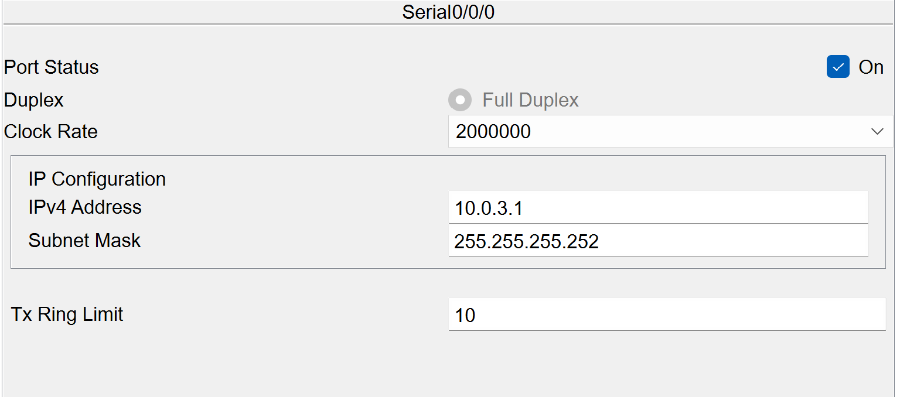
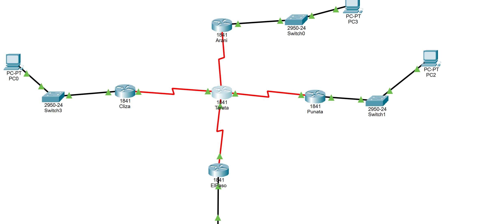
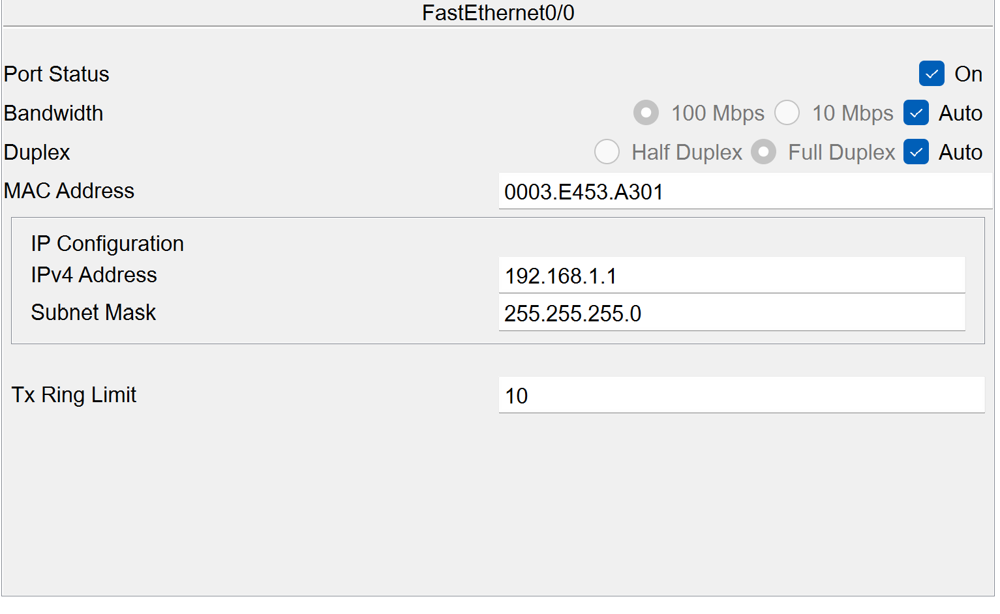
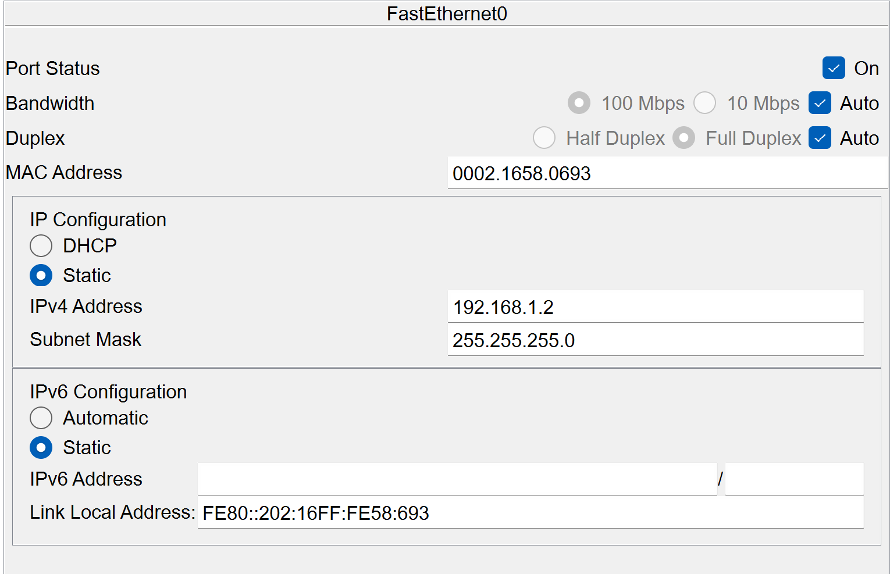

# Examen

Como se puede ver use esta configuracion para cada router y conectarlo ya es es Clase A y es un WAN y esta conectado con cada router de forma serial para que pueda a ver conexiones entre ellos.

aqui se pueda apreciar la conexion entre los routers y swicths y PC que a continuacion se mostrara su conexion de cada uno.

Esta es la conexion de router a un switch para el uso de FastEthernet que lleva de igual froma la conexion entre todos los swhitchs cambiando obviamente las direcciones para que funcione de forma correcta.

Aqui se ve la conexicion estatica de cada uno de lass PC,s para que este funcionando correctamente y se envien archivos mutuamente. al parcer todo esta bien pero algo esta fallando entre las comunicaciones y no pueden hacer "ping" las computadoras que eso tengo que ver el problema y solucionarlo.
